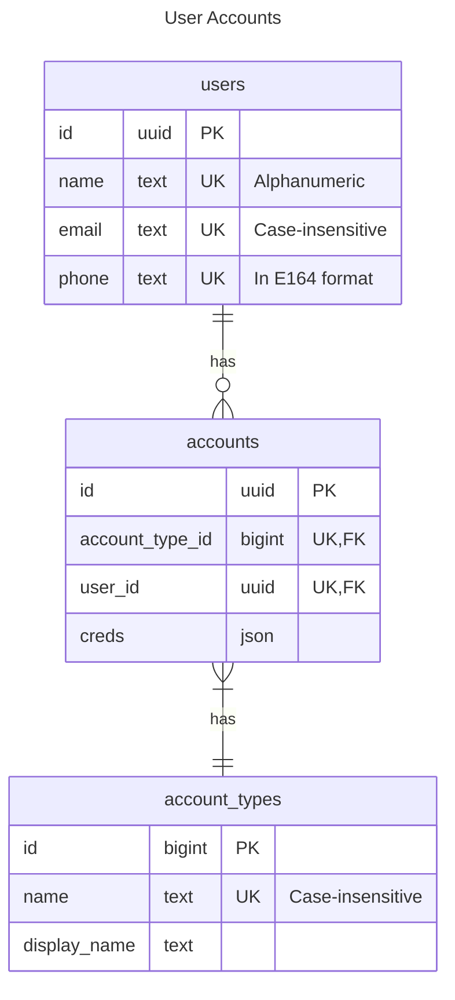

# Auth Domain


The Auth Domain stores data related to user details and their accounts on _MyApp_. Users can link accounts from different providers, and unlink them.


## Tables


<details>

<summary>Migration Script</summary>

```sql
CREATE EXTENSION CITEXT;

CREATE TABLE users (
	-- PK
	id UUID DEFAULT gen_random_uuid(),

	-- Attributes.
	name TEXT NOT NULL,
	email CITEXT NOT NULL,
	phone TEXT NOT NULL,

	-- Timestamps.
	created_at TIMESTAMPTZ NOT NULL DEFAULT current_timestamp,
	updated_at TIMESTAMPTZ NOT NULL DEFAULT current_timestamp,

	-- Constraints.
	PRIMARY KEY (id),
	UNIQUE (name),
	UNIQUE (email),
	UNIQUE (phone)
);
```

</details>

### Users

Stores the user of the application.

**Columns**
- name
	- Rule: Alphanumeric
	- Rule: Profanity Filter
- email
	- [Rule: Email Format](#rule-email-format)
	- [Rule: Disallow Email Alias](#rule-disallow-email-alias)
- phone
	- [Rule: Phone Number Format](#rule-phone-number-format)


### Accounts
Stores the account details of the user. User usually have one primary email with phone number account, but they can additionally link other providers as well.

There are no max number of providers, but they should be unique.

### Account Types

Reference table that stores the authentication providers such as Facebook, Email, Google, Email.

## ER Diagram

> NOTE: Fields like `created_at/updated` at is now shown, but is assumed to be part of the schema.




## Queries

Describes the operations that retrieves data from the database.

### New Users in the last 30 days

```sql
SELECT *
FROM users
WHERE created_at > now() - INTERVAL '1 month'
```

## Mutations

Describes the operations that changes data in the database.

### Creating New User

Creates a new unique User.

```sql
INSERT INTO users (
	name,
	email,
	phone
) VALUES (
	'John Appleseed', -- name,
	'john.appleseed@mail.com', -- email,
	'+601234567890' --phone
)
RETURNING *
```

```psql
test=# \x on; # Enable extended output.
test=# select * from users;
-[ RECORD 1 ]------------------------------------
id         | 5f52b2c5-e0de-41ae-9dbd-767a134a2a02
name       | John Appleseed
email      | john.appleseed@mail.com
phone      | +601234567890
created_at | 2023-05-18 13:25:06.208399+00
updated_at | 2023-05-18 13:25:06.208399+00
```

### Populating Account Types


```sql
INSERT INTO account_types (name) VALUES
	('email'),
	('phone'),
	('apple'),
	('facebook'),
	('google'),
	('github'),
	('github')
RETURNING *
```

### Creating New Account

Create a new `email` account for
```sql
INSERT INTO accounts (account_type_id, user_id) VALUES
	(
		(SELECT id FROM account_types name = 'email' LIMIT 1),
		(SELECT id FROM users WHERE email = 'john.appleseed@mail.com' LIMIT 1)
	)
RETURNING *
```

## Business Rules

### Rule: Email Format

The email follows Gmail email design, which is case-insensitive [^1]. In Postgres, there is `citext` extension to help with case-insensitive. If the database you use don't support it, just lowercase it before inserting the data.

Example:

```bash
# All 3 emails are treated as the same.
# Using CITEXT helps to preserve the case (mostly for UI presentation).
john.appleseed@mail.com
JOHN.appleseed@mail.com
JOHN.APPLESEED@MAIN.COM
```

### Rule: Disallow Email Alias

Email alias is made popular by Gmail [^2]. However, you might to block it to prevent users from creating spam accounts on your app.

Example:

```diff
# Good
+ john.appleseed@gmail.com

# Bad
- john.appleseed+1@gmail.com
- john.appleseed+test@gmail.com
```

### Rule: Phone Number Format


Phone number should be formatted to E164 format before being saved into the database. The E164 format has the plus before the country code and the phone number.

```diff
# Good
+ +601234567890

# Bad
- 601234567890
- 01234567890
```

### Rule: Unique

There should not exists two or more rows that has the same value.


[^1]: https://www.tutorialspoint.com/are-gmail-addresses-case-sensitive#:~:text=The%20short%20answer%20to%20this,lowercase%20when%20they%20are%20entered.
[^2]: https://gmail.googleblog.com/2008/03/2-hidden-ways-to-get-more-from-your.html?m=1
