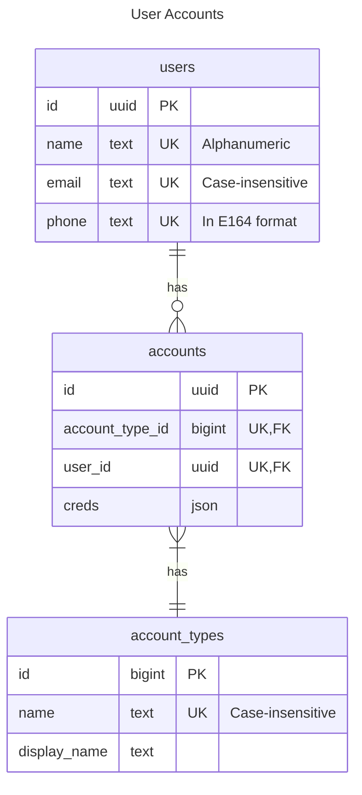

# Auth Domain

The Auth Domain manages data related to user details and accounts on MyApp.


## Tables

### Users


Stores the user of the application.

- name
	- Rule: Alphanumeric Column
- email
	- [Rule: Email Format](#rule-email-format)
- phone
	- Rule: Phone Number Format

### Accounts
Stores the account details of the user.

### Account Types

Reference table that stores the authentication providers such as Facebook, Email, Google, Email.

## ER Diagram

> NOTE: Fields like `created_at/updated` at is now shown, but is assumed to be part of the schema.




## Queries

Describes the operations that retrieves data from the database.

### New Users in the last 30 days

```sql
SELECT *
FROM users
WHERE created_at > now() - INTERVAL '1 month'
```

## Mutations

Describes the operations that changes data in the database.

### Creating New User

Creates a new unique User.

```sql
INSERT INTO users (
	name,
	email,
	phone
) VALUES (
	'John Appleseed', -- name,
	'john.appleseed@mail.com', -- email,
	'+601234567890' --phone
)
RETURNING *
```

### Populating Account Types


```sql
INSERT INTO account_types (name) VALUES
	('email'),
	('phone'),
	('apple'),
	('facebook'),
	('google'),
	('github'),
	('github')
RETURNING *
```

### Creating New Account

Create a new `email` account for
```sql
INSERT INTO accounts (account_type_id, user_id) VALUES
	(
		(SELECT id FROM account_types name = 'email' LIMIT 1),
		(SELECT id FROM users WHERE email = 'john.appleseed@mail.com' LIMIT 1)
	)
RETURNING *
```

## Business Rules

### Rule: Email Format

The email follows Gmail email design, which is case-insensitive [^1]. In Postgres, there is `citext` extension to help with case-insensitive. If the database you use don't support it, just lowercase it before inserting the data.


[^1]: https://www.tutorialspoint.com/are-gmail-addresses-case-sensitive#:~:text=The%20short%20answer%20to%20this,lowercase%20when%20they%20are%20entered.
