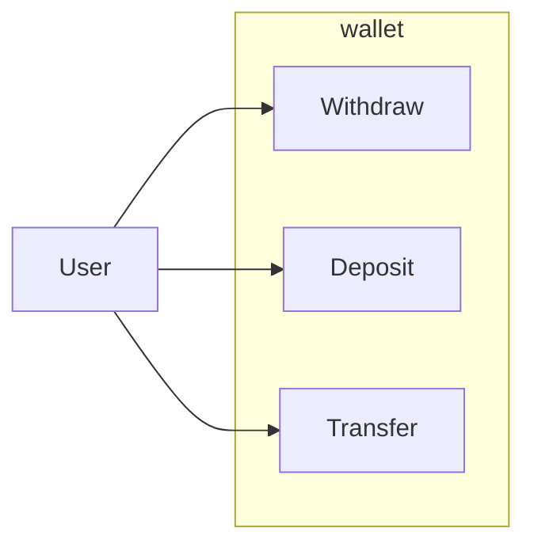

# Wallet Domain

Wallet and wallet transactions.



## Tables

<details>
<summary>Migration</summary>


```sql
create table users (
  -- PK.
  id uuid default gen_random_uuid(),

  -- Attributes.
  name text not null,

  -- Timestamps.
  created_at timestamptz not null default current_timestamp(),
  updated_at timestamptz not null default current_timestamp(),

  -- Constraints.
  primary key (id),
  unique (name)
);

create table wallets (
  -- PK.
  id uuid default gen_random_uuid(),

  -- Attributes.
  name text not null,
  balance bigint not null,

  -- FK.
  user_id uuid not null,

  -- Timestamps.
  created_at timestamptz not null default current_timestamp(),
  updated_at timestamptz not null default current_timestamp(),

  -- Constraints.
  primary key (id),
  foreign key (user_id) references users(id)
);

create type wallet_transaction_type as enum('deposit', 'withdraw');

create type wallet_transaction_status as enum('pending', 'success', 'failed');

create table wallet_transactions (
  -- PK.
  id uuid default gen_random_uuid(),

  -- Attributes.
  currency_code text not null,
  amount bigint not null,
  type wallet_transaction_type not null,
  status wallet_transaction_status not null,

  -- FK.
  wallet_id uuid not null,
  user_id uuid not null,

  -- Timestamps.
  created_at timestamptz not null default current_timestamp(),
  updated_at timestamptz not null default current_timestamp(),

  -- Constraints.
  primary key (id),
  foreign key (wallet_id) references wallets(id)
);

create table wallet_transfers (
)
```

</details>

### Table 1

<insert description of table>

Columns
- column1
  - Rule: Rule A
  - Rule: Rule B
  - Rule: Rule Z
- column2
- columnn


### Table 2
### Table N

## ER Diagram

<insert mermaid erDiagram here>


## Queries

<insert queries here>

## Mutations

<insert mutations here>


## Business Rules

### Rule: Rule A

<insert rules here>

### Rule: Rule B
